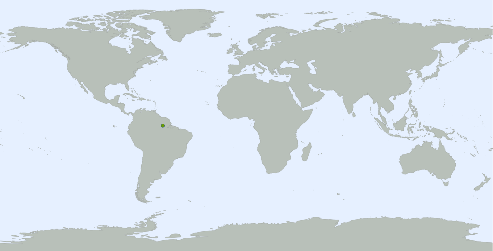
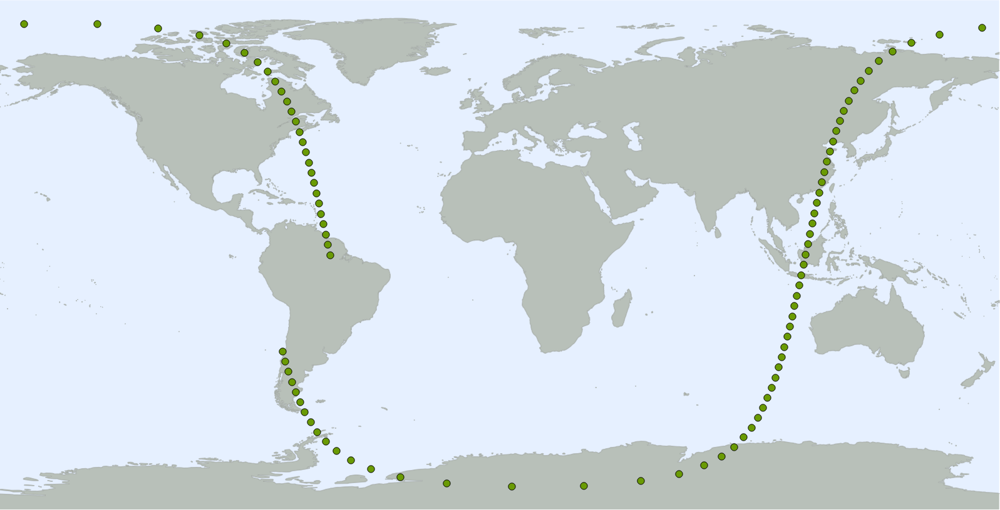
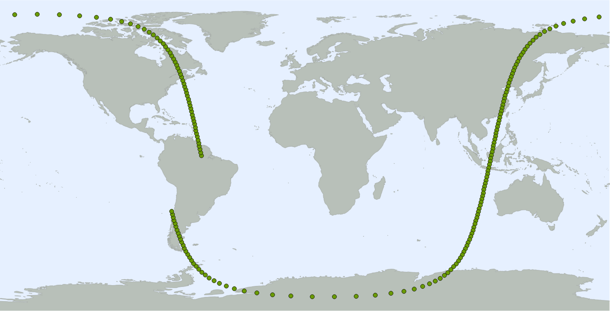
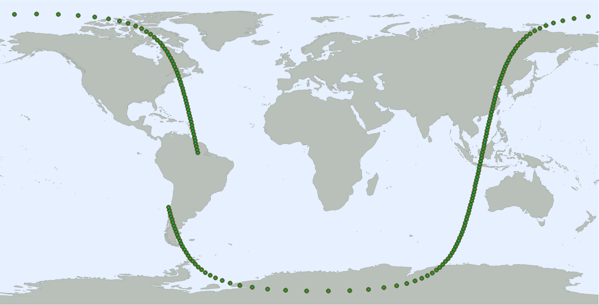
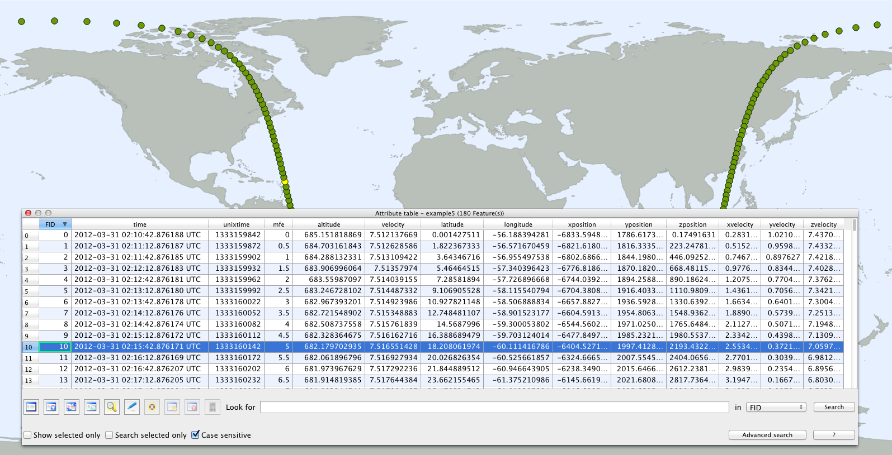
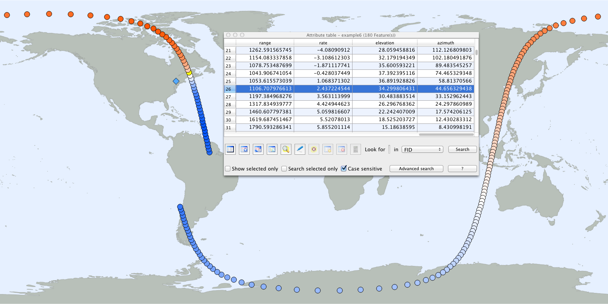
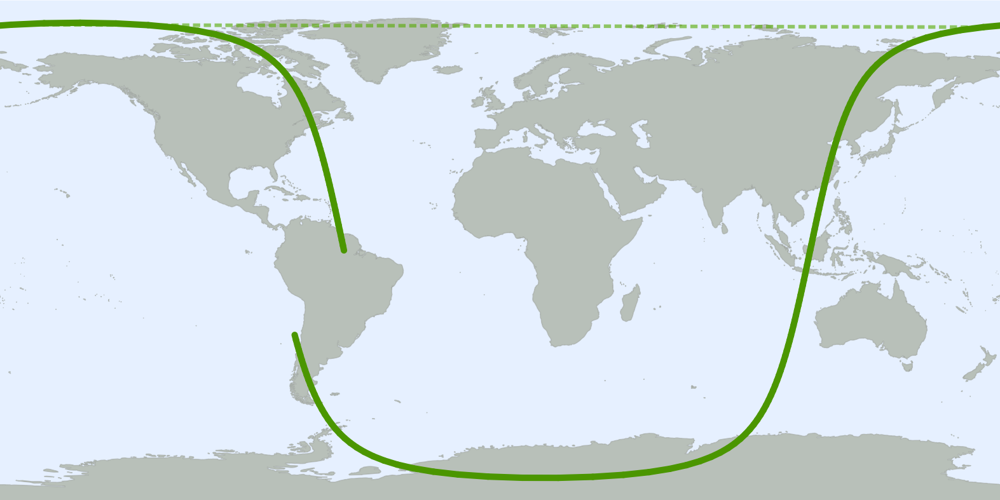

We'll start with a current two-line element set for GeoEye 1. At CelesTrak, it is listed as an [Earth Resources](http://www.celestrak.com/NORAD/elements/resource.txt) satellite. For this example, we only want to deal with one satellite, so we'll copy the relevant lines and save them as `geoeye1.tle`:

	GEOEYE 1                
	1 33331U 08042A   12091.09077403  .00000328  00000-0  70846-4 0  9565
	2 33331  98.1132 165.3484 0011197 115.0161 245.2220 14.64451624190457

We can specify two-line element sets in a couple ways, but for clarity we will use the `--input` option throughout this example. We'll also use the `--output` option to explicitly name the output files. (Otherwise, `gtg` would use the satellite number, `33331`, as the default name.) In each case here, the output will consist of a set of four files (.shp, .shx, .dbf, and .prj) which share the specified base name and comprise a shapefile.

### 1

We'll start with a very simple case:

	gtg --input geoeye1.tle --output example1

In this case, the output consists of a single point representing the location of GeoEye 1 at the "epoch" (reference date) specified in the two-line element set. In `geoeye1.tle`, the epoch is encoded as `12091.09077403`. The first [two digits](http://www.celestrak.com/columns/v04n03/#FAQ04) specify the year, 2012, and the remaining digits specify the day of the year, 91.09077403 (at some point on March XX).

Here's the point. It's over South America:

### 2

One point may be useful, but now let's generate an actual ground track:

	gtg --input geoeye1.tle --output example2 --start epoch --end epoch+90m

For clarity, we've explicitly specified the default starting time. We've also added an end time 90 minutes after the epoch. By specifying an end time, we've told `gtg` that we want it to generate a ground track of GeoEye 1's path over that period. Here's what it looks like:

A series of 90 points has produced, starting with the same point we saw in example 1.

### 3

From example 2, you can deduce that, by default, `gtg` generates ground track points at one-minute intervals. We can use the `--interval` option to control this behavior:

	gtg --input geoeye1.tle --output example3 --start epoch --end epoch+90m --interval 30s

By halving the interval to 30 seconds, we've doubled the number of output points to 180, resulting in a "smoother" ground track for the same period:

### 4

As an alternative to specifying an `--end` time, you can state how many `--steps` to generate.

	gtg --input geoeye1.tle --output example4 --start epoch --interval 30s --steps 180

This combination of options produces the same ground track as example 3:

### 5

Plotting the ground track points is useful, but next let's put `gtg` to work telling us more about the situation at each point.

	gtg --input geoeye1.tle --output example5 --start epoch --interval 30s --steps 180 --attributes standard

We've added the `--attributes` option to tell `gtg` that we want it to add some fields to the output shapefile's attribute table. The `standard` argument is a shortcut that means we want all the information `gtg` can provide without any additional setup. Here's a peek at the attribute table. The ground track point corresponding to the selected record is highlighted in yellow:

The `FID` field is an index number. `time` is the [UTC](https://en.wikipedia.org/wiki/Coordinated_Universal_Time) timestamp of the point. `unixtime` is the number of seconds since 00:00:00 UTC, 1 January 1970 (a [common format](https://en.wikipedia.org/wiki/Unix_time) for recording event times). `mfe` is "minutes from epoch", the relative offset between the two-line element set's epoch and point's time (the orbital perturbation model is most accurate closest to 0). `altitude` is the satellite's altitude in kilometers. `velocity` is actually the magnitude of the satellite's velocity relative to the ["Earth-Centered Inertial" (ECI) coordinate system](http://www.celestrak.com/columns/v02n01/), expressed in kilometers per second. `xposition`, `yposition`, and `zposition` are the ECI coordinates of the satellite in kilometers. Likewise, ` xvelocity`, `yvelocity`, and `zvelocity` are the components of the satellite's ECI velocity, in kilometers per second.

### 6

Now let's specify the location of a ground `--observer` and ask for `all` attributes.

	gtg --input geoeye1.tle --output example6 --start epoch --interval 30s --steps 180 --attributes all --observer 42.102222 -75.911667

In this case, we've specified an observer in the northeast US (represented by the blue diamond in the image below). For each point, `gtg` now outputs a few attributes relative to this location: `range` is the distance is kilometers, `rate` is the rate of range change in kilometers per second (negative values suggest the satellite is approaching; positive values suggest it is receding), and `azimuth` and `elevation` specify where the observer should look (in the [horizontal coordinate system](http://en.wikipedia.org/wiki/Horizontal_coordinate_system) - degrees clockwise from north and degrees above the horizon, respectively) to observe the satellite.

In this image, the ground track points are color coded by `rate` - the satellite is coming closer to the observer when the points are blue and getting further when the points are red. The attributes of the yellow highlighted points are selected in the attribute table. Its `azimuth` is 44.6 - very nearly to the northeast of the observer.

### 7

In this last example, we'll represent the ground track as a continuous line instead of a series of points.

	gtg --input geoeye1.tle --output example7 --start epoch --interval 30s --steps 180 --features line --split

The `--features` option is used to specify that we want to output `line` features (the default is `point`). The `--split` option splits line segments that cross the 180th meridian into two line segments, one with longitudes <= 180 and the other with longitudes >= -180. (Otherwise, many mapping programs may misinterpret the direction of the line segment, as illustrated by the dotted line on the map below.)

Note that the behavior of `--split` is untested for large intervals (eg, cases where consecutive points skip hemispheres or orbits). However, `line` mode is probably not appropriate in these cases anyway, since small intervals are required to produce a smooth path.

---

For more details on the options `gtg` understands, please see:

	gtg --help
